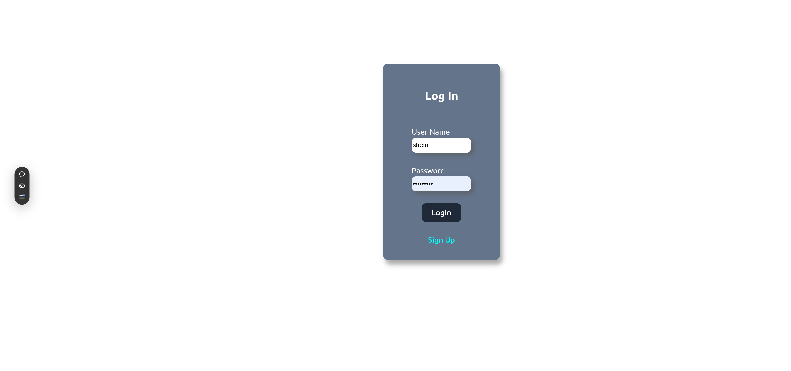

# Blog frontend

https://blog-api-website1.vercel.app/
## About
<div align="center">
  
</div>

### description
A simple blog posting website, levelraging passport & jwt for log in and security.

### built with
These are tools that I used to build the site

<ul>
  <li>
    <a href="https://react.dev/">React</a>
  </li>
  <li>
    <a href="https://nodejs.org/en">Node.js</a>
  </li>
  <li>
    <a href="https://expressjs.com/">Express</a>
  </li>
  <li>
    <a href="https://www.mongodb.com/">MongoDB</a>
  </li>
  <li>
    <a href="https://mongoosejs.com/">Mongoose</a>
  </li>
  <li>
    <a href="https://www.passportjs.org/">Passport</a>
  </li>
  <li>
    <a href="https://jwt.io/">jwt</a>
  </li>
</ul>

### backend repository
https://github.com/Shemuel-bot/blog-api.git

## Local setup

```sh
npm run dev
```
